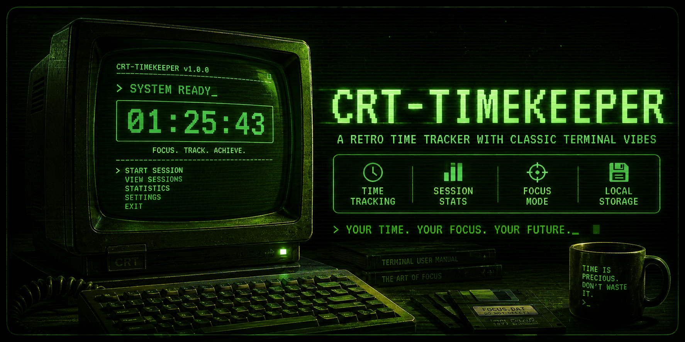

# 🖥️ CRT-Timekeeper

<p align="center">
  
</p>

<p align="center">
  <b>A retro-inspired time tracking web app built with a classic CRT terminal aesthetic.</b>
</p>

<p align="center">
  <a href="https://asaedgerunner.github.io/CRT-Timekeeper/">
    🌐 Live Demo
  </a>
</p>

<p align="center">
  
  
  
</p>

---

# 📟 About

**CRT-Timekeeper** is a minimalist time tracking application inspired by the golden age of personal computers.

It recreates the feeling of an old CRT terminal with:

- Phosphor green monochrome display
- Scanlines and screen flickering effects
- Retro terminal typography
- BIOS-style boot sequence
- DOS-inspired interface elements

Designed for people who love:
- Retro computing
- Cyberpunk aesthetics
- Minimal productivity tools
- Classic computer interfaces

---

# 🌐 Try It Online

No installation required.

Open CRT-Timekeeper directly in your browser:

👉 https://asaedgerunner.github.io/CRT-Timekeeper/

Works on:

- Windows
- Linux
- macOS
- Mobile browsers

---

# ✨ Features

## 🖥️ CRT Display Simulation

- Authentic CRT curved screen effect
- Scanline overlay
- Random flicker animation
- Moving refresh beam effect
- Phosphor glow

## ⏱️ Time Tracking

- Simple and distraction-free timer
- Recording status indicator
- Retro styled time display

## 💾 Classic Computer Experience

- VT323 pixel terminal font
- BIOS-inspired startup sequence
- DOS-style double borders
- Old-school terminal interface

---

# 🐧 Linux Installation

CRT-Timekeeper includes a native Linux installer.

Clone the repository:

```bash
git clone https://github.com/AsaEdgerunner/CRT-Timekeeper.git
```

Enter the project directory:

```bash
cd CRT-Timekeeper
```

Run installer:

```bash
chmod +x install.sh
./install.sh
```

The application will appear in your desktop application menu.

---

# 🪟 Windows Usage

Windows users can run CRT-Timekeeper directly from the web version:

🌐 https://asaedgerunner.github.io/CRT-Timekeeper/

No installation required.

---

# 📸 Screenshot

<p align="center">
  
</p>

---

# 🛠️ Technologies

Built with:

- HTML5
- CSS3
- JavaScript
- SVG
- Google Fonts (VT323)

---

# 🗺️ Roadmap

## ✅ Version 1.0

- [x] CRT visual system
- [x] Retro boot sequence
- [x] Web deployment
- [x] Linux installer

## 🚧 Version 1.5

- [ ] Save sessions
- [ ] Time history
- [ ] Export reports
- [ ] More CRT themes

## 🔮 Version 2.0

- [ ] Local database
- [ ] Desktop packages
- [ ] Advanced productivity statistics

---

# 🤝 Contributing

Contributions, ideas, and suggestions are welcome.

Feel free to open an issue or submit a pull request.

---

# 📜 License

This project is licensed under the MIT License.

---

<p align="center">
  Built with 💚 and nostalgia for classic computers.
</p>
